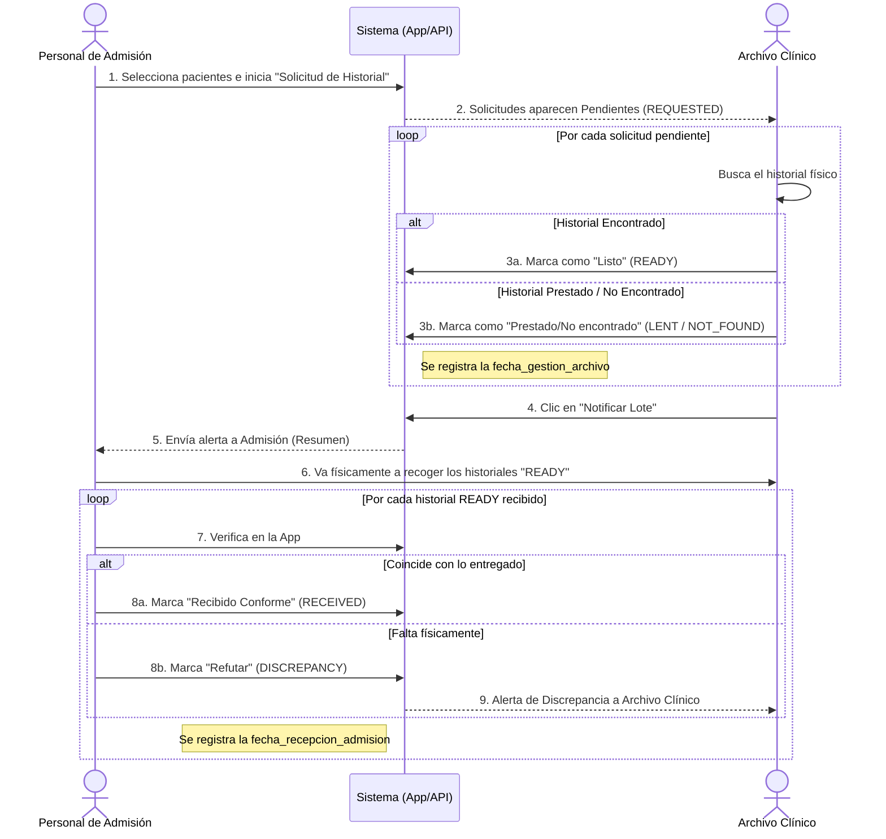
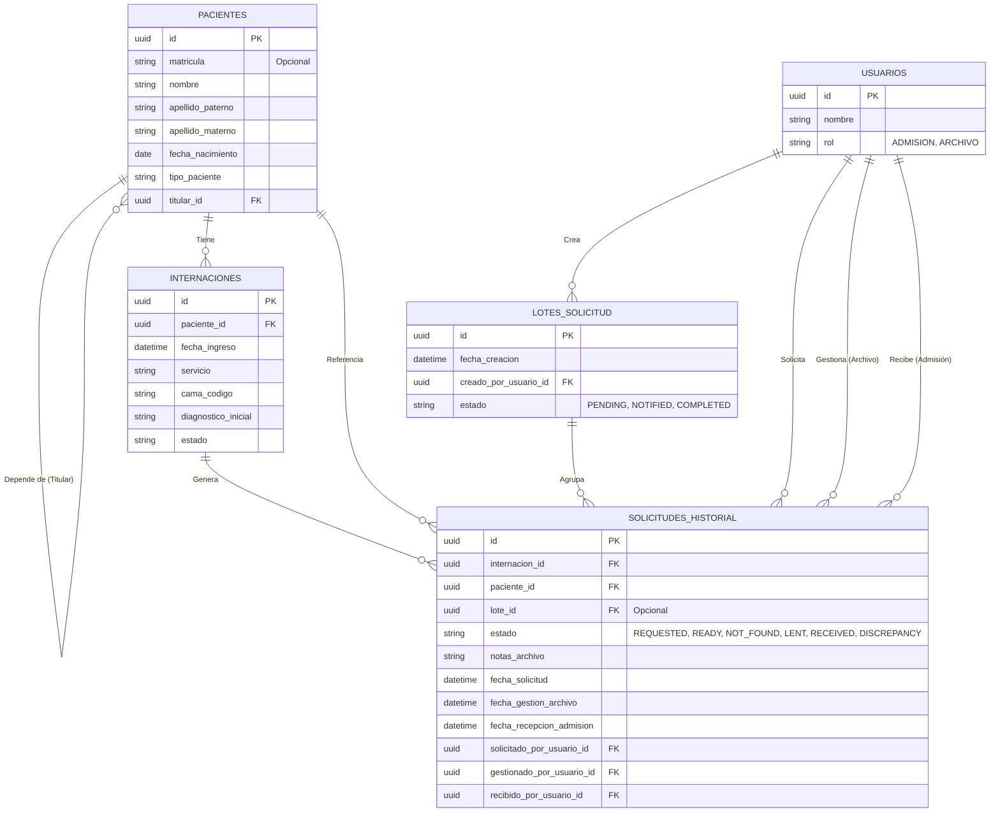

# Especificación Técnica: Módulo de Gestión y Trazabilidad de Historiales Clínicos

## 1. Objetivo del Módulo
El objetivo de este módulo es digitalizar el control, gestión y trazabilidad de los historiales clínicos entre los servicios de Admisión y Archivo Clínico. Actualmente, el proceso se lleva en un cuaderno manual donde existen vacíos de información, pérdidas de historiales y problemas en la validación de entrega y recepción. La digitalización permite asegurar el rastreo de quién solicita, quién busca y quién recibe el historial en tiempo real.

## 2. Análisis del Problema y Eventos
El ciclo de vida de un historial clínico para internación consta de los siguientes eventos clave, los cuales ahora quedan formalizados:

1. **Solicitud (`REQUESTED`)**: Admisión requiere el historial de pacientes recién ingresados (generalmente consolidado a las 6:00 AM).
2. **Búsqueda y Actualización (`READY` / `NOT_FOUND` / `LENT`)**: Archivo Clínico busca el historial y dictamina su estado. Cualquier actualización aquí significa que la solicitud ya fue **gestionada**.
3. **Notificación de Lote**: Archivo Clínico notifica a Admisión que ha terminado la búsqueda de un lote de solicitudes, enviando un resumen de cuáles están listos y cuáles no se encontraron o están prestados.
4. **Recepción Conforme (`RECEIVED`)**: Admisión recoge físicamente los historiales marcados como listos (`READY`) y confirma en el sistema.
5. **Discrepancia/Refutación (`DISCREPANCY`)**: Admisión reporta que un historial marcado como `READY` por el Archivo, no se encuentra físicamente en el lote entregado.

## 3. Diagrama de Flujo del Proceso



## 4. Diseño de Base de Datos (ERD)

El siguiente diagrama ilustra cómo el nuevo módulo se integra con las tablas (o colecciones) maestras existentes:



## 5. Estructuras de Datos (JSON / API Payload)

La entidad central desnormalizará datos de consulta frecuente (como nombres y código de cama) para que las vistas del lado de Archivo Clínico no requieran queries anidadas costosas.

```json
{
  "id": "uuid",
  "paciente_id": "uuid",
  "internacion_id": "uuid",
  "lote_id": "uuid_opcional",
  
  "nombre_paciente": "Davila Susano Elizabeth",
  "matricula_paciente": "19525414DSE",
  "matricula_titular": "19500504ZBH",
  "cama_codigo": "216-B",
  
  "estado": "REQUESTED", 
  "notas_archivo": null, 
  
  "fecha_solicitud": "2026-09-17T06:00:00Z",
  "fecha_gestion_archivo": "2026-09-17T06:20:00Z",
  "fecha_recepcion_admision": "2026-09-17T06:45:00Z",
  
  "solicitado_por_usuario_id": "uuid",
  "gestionado_por_usuario_id": "uuid",
  "recibido_por_usuario_id": "uuid"
}
```

### Endpoints Propuestos (Fase 1)
1. **`POST /api/historiales/solicitudes`**: Crea el lote (Admisión).
2. **`GET /api/historiales/solicitudes?fecha=YYYY-MM-DD`**: Retorna el lote del día para ser buscado (Archivo).
3. **`PATCH /api/historiales/solicitudes/{id}/estado`**: Archivo Clínico asienta `READY`, `NOT_FOUND` o `LENT` e imprime su huella en `fecha_gestion_archivo`.
4. **`POST /api/historiales/solicitudes/notificar-lote`**: Push notification al culminar la búsqueda del día.
5. **`PATCH /api/historiales/solicitudes/{id}/recepcion`**: Admisión escanea/confirma la recepción, o reporta un faltante (`RECEIVED` vs `DISCREPANCY`), dejando huella en `fecha_recepcion_admision`.

## 6. Fases de Construcción
- **Fase 1**: Desarrollo del Backend (API, creación de tablas, migraciones).
- **Fase 2**: Integración de las pantallas móviles (prototipadas).
- **Fase 3**: Dashboard en la aplicación Web para análisis estadísticos (ej. porcentaje de pérdidas de historias, tiempos promedio de entrega).
